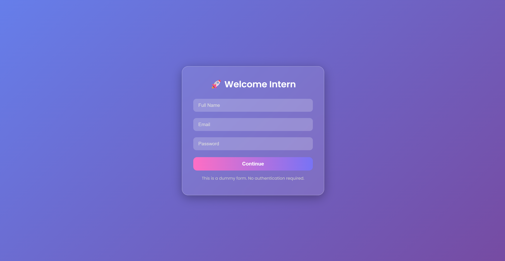
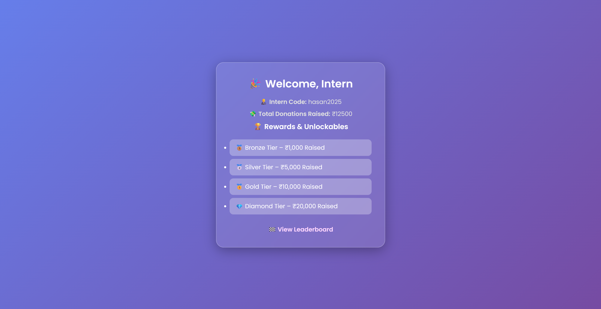
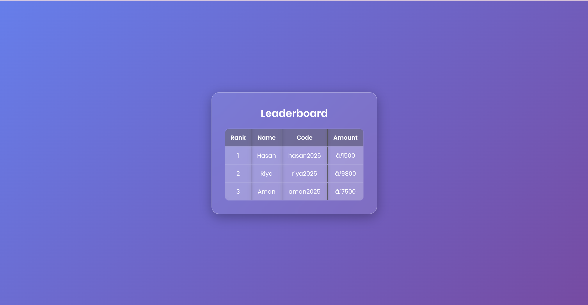

# Intern Dashboard – Submission


## 📸 Screenshots
| Login Page | Dashboard | Leaderboard |
|------------|-----------|-------------|
|  |  |  |

## 📂 Setup Instructions

### Frontend
1. Open `frontend/index.html` in your browser
2. Or use VS Code + Live Server

### Backend
1. Go to `backend/` folder
2. Run:
   ```bash
   npm install
   node server.js

---

If you want, I can:
- Help you create the `README.md`
- Help you deploy to Netlify or Vercel step-by-step  
Let me know!
